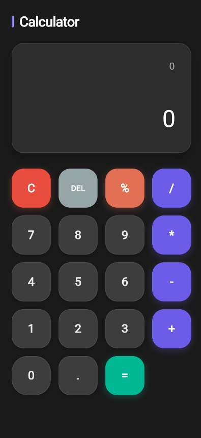

# Flutter Calculator

A modern, user-friendly calculator application built with Flutter, utilizing the BLoC pattern for state management. This app supports basic arithmetic operations (addition, subtraction, multiplication, division) and includes both on-screen button and keyboard input support, making it versatile for mobile, desktop, and web platforms. The app features a clean, responsive UI and robust error handling for invalid expressions.

## Features
- **Arithmetic Operations**: Supports addition (+), subtraction (-), multiplication (*), and division (/).
- **Clear and Delete**: Clear (C) resets the expression and result; Delete (DEL) removes the last character.
- **Decimal Support**: Handles decimal numbers for precise calculations.
- **Keyboard Input**: Supports regular and numpad keys (0-9, operators, Enter, Backspace, Escape).
- **Error Handling**: Displays "Error" for invalid expressions (e.g., division by zero).
- **Responsive Design**: Adapts to various screen sizes across mobile, desktop, and web.
- **State Management**: Uses the BLoC pattern for efficient and maintainable state handling.
- **Expression Evaluation**: Leverages the `math_expressions` package for accurate calculations.

## Demo


## Getting Started

### Prerequisites
- [Flutter SDK](https://flutter.dev/docs/get-started/install) (version 3.8.0 or higher)
- A code editor (e.g., [VS Code](https://code.visualstudio.com/) or [Android Studio](https://developer.android.com/studio))
- A connected device, emulator, or web browser for testing

### Installation
1. **Clone the repository**:
   ```bash
   git clone https://github.com/adhilkrishnag/calculator.git
   cd calculator
   ```

2. **Install dependencies**:
   Run the following command to fetch the required dependencies:
   ```bash
   flutter pub get
   ```

3. **Run the app**:
   Ensure a device, emulator, or browser is connected, then run:
   ```bash
   flutter run
   ```
   For web, use:
   ```bash
   flutter run -d chrome
   ```

### Dependencies
- `flutter_bloc: ^9.1.1`: For state management using the BLoC pattern.
- `cupertino_icons: ^1.0.8`: For iOS-style icons.
- `math_expressions: ^2.7.0`: For parsing and evaluating mathematical expressions.
- `flutter_lints: ^4.0.0`: For code linting and analysis.

## Project Structure
```
calculator/
├── lib/
│   ├── main.dart                    # App entry point and UI (Home widget)
│   ├── logic/
│   │   ├── blocs/
│   │   │   ├── calculator_bloc/
│   │   │   │   ├── calculator_bloc.dart  # BLoC logic for state management
├── pubspec.yaml                    # Dependency configuration
├── assets/                         # Optional: Add screenshots or icons
├── android/, ios/, web/           # Platform-specific configurations
```

## Usage
- **On-Screen Buttons**:
  - Numbers (0-9) and decimal point (.) to build expressions.
  - Operators (+, -, *, /) for arithmetic operations.
  - `C` to clear the expression and result.
  - `DEL` to remove the last character.
  - `=` to evaluate the expression.
- **Keyboard Input**:
  - Regular and numpad numbers (0-9) and decimal point (.).
  - Regular and numpad operators (+, -, *, /).
  - Enter (or Numpad Enter) to evaluate the expression.
  - Backspace to delete the last character.
  - Escape to clear the expression and result.
- **Display**: Shows the current expression and the result of the last calculation.

## Contributing
Contributions are welcome! To contribute:
1. Fork the repository.
2. Create a new branch:
   ```bash
   git checkout -b feature/your-feature
   ```
3. Commit your changes:
   ```bash
   git commit -m 'Add your feature'
   ```
4. Push to the branch:
   ```bash
   git push origin feature/your-feature
   ```
5. Create a Pull Request.

Please ensure your code follows the [Flutter style guide](https://flutter.dev/docs/development/tools/formatting) and includes tests where applicable.

## Testing
The project includes a `flutter_test` dependency for unit and widget testing. To run tests:
```bash
flutter test
```
Future improvements may include unit tests for the `CalculatorBloc` to verify input validation and calculation logic.

## Future Enhancements
- Add support for advanced operations (e.g., percentages, parentheses, square root).
- Implement calculation history.
- Enhance UI with glassmorphism or gradient styles.
- Add unit tests for BLoC and keyboard input handling.

## License
This project is licensed under the MIT License - see the [LICENSE](LICENSE) file for details.

## Acknowledgments
- Built with [Flutter](https://flutter.dev/) and [Dart](https://dart.dev/).
- Uses [flutter_bloc](https://pub.dev/packages/flutter_bloc) for state management.
- Powered by [math_expressions](https://pub.dev/packages/math_expressions) for mathematical evaluations.

---
*Project created by [Adhil Krishna G]. For issues or suggestions, open an issue on GitHub or contact [adhil9001@gmail.com].*